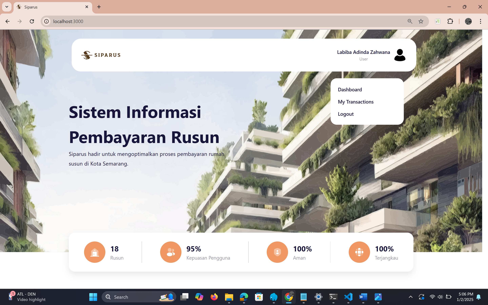
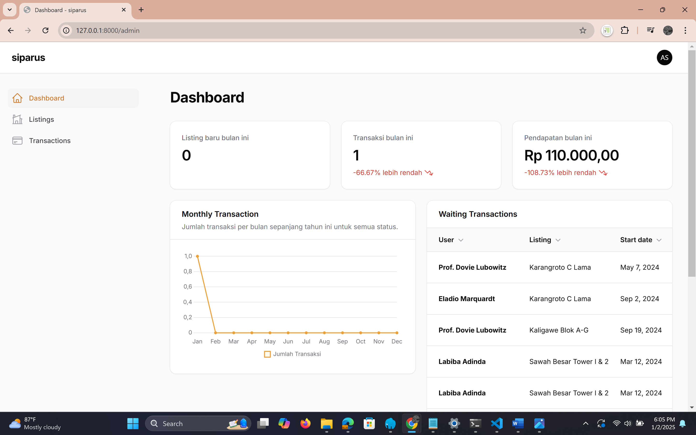

# SIPARUS

## 📌 **Deskripsi Proyek**
**SIPARUS** adalah platform berbasis web untuk mengelola pembayaran sewa dan invoice calon penghuni Rumah Susun Kota Semarang, menggunakan teknologi **Laravel 11** (Backend), **Next.js 14** (Frontend), dan **MySQL**. Sistem ini terdiri dari dua bagian utama:
1. **Website Admin**: Backend yang dikelola dengan Laravel dan Filament.
2. **Website Calon Penghuni**: Frontend yang dibangun dengan Next.js, berkomunikasi dengan API Laravel.

---
## 📸 **Tampilan Dashboard**

### **Dashboard Calon Penghuni**
Berikut adalah tampilan **Dashboard Calon Penghuni**:



### **Dashboard Admin**
Berikut adalah tampilan **Dashboard Admin**:



## 🛠 **Cara Setup SIPARUS**

### **1. Setup Backend (Laravel 11)**
Langkah pertama adalah menyiapkan **backend API** yang dibangun menggunakan **Laravel 11**. Berikut adalah langkah-langkahnya:

```bash
# Clone repository proyek
git clone https://github.com/labibaadinda/Sistem-Informasi-Pembayaran-dan-Pengelolaan-Rusun-Kota-Semarang.git

# Masuk ke direktori backend
cd SIPARUS-backend

# Install dependensi menggunakan Composer
composer install

# Salin file konfigurasi .env
cp .env.example .env

# Edit file .env untuk menyesuaikan konfigurasi database:
# - DB_DATABASE=nama_database
# - DB_USERNAME=nama_user_mysql
# - DB_PASSWORD=password_mysql

# Generate aplikasi key Laravel
php artisan key:generate

# Lakukan migrasi database
php artisan migrate

# Jalankan server Laravel
php artisan serve
```

Setelah langkah-langkah di atas, backend API akan berjalan pada **http://localhost:8000**.

### **2. Setup Frontend (Next.js 14)**
Untuk menyiapkan bagian frontend yang menggunakan **Next.js 14**, ikuti langkah-langkah berikut:

```bash
# Masuk ke folder frontend
cd SIPARUS-prototype-main

# Install dependensi menggunakan npm
npm install

# Jalankan aplikasi Next.js
npm run dev
```

Frontend akan berjalan di **http://localhost:3000**.

### **3. Menghubungkan Backend dan Frontend**
Agar frontend dapat berkomunikasi dengan backend, perlu memastikan bahwa API yang disediakan oleh Laravel dapat diakses oleh frontend. Bisa menggunakan **fetch API** atau **Axios** di Next.js untuk mengakses endpoint dari Laravel.

Contoh endpoint API yang dapat diakses:
- **Login**: `POST /api/login`
- **Daftar Rusun**: `GET /api/rusun`
- **Detail Rusun**: `GET /api/rusun/{id}`

---

## 🔎 **Pengujian API dengan Postman**
Jika ingin menguji API, dapat menggunakan **Postman** untuk mengirimkan permintaan ke endpoint API. Berikut adalah langkah-langkahnya:

1. **Unduh dan instal Postman** dari [sini](https://www.postman.com/).
2. **Import koleksi API** yang disediakan (jika ada).
3. Gunakan URL endpoint **`http://localhost:8000/api/`** untuk mengakses berbagai resource.

---

## 🌐 **API untuk Admin dan Calon Penghuni**
- **Website Admin**: [http://localhost:8000/admin](http://localhost:8000/admin)
- **Website Calon Penghuni**: [http://localhost:3000](http://localhost:3000)

API dikembangkan untuk menangani manajemen rusun, transaksi, dan konfirmasi pembayaran melalui WhatsApp.

---

## 📂 **Struktur Repository**
```
siparus-project/
├── SIPARUS-backend/   
├── SIPARUS-prototype-main/   
├── images
│   ├── dashboard_user.png
│   ├── dashboard_admin.png
├── LaporanPKL_LabibaAdindaZaahwana.pdf   
├── Presentasi_PKL.pdf
├── README.md
└── siparus.sql

```

---

## 🔗 **Tautan Repository**
- **[GitHub Repository](https://github.com/labibaadinda/Sistem-Informasi-Pembayaran-dan-Pengelolaan-Rusun-Kota-Semarang)**

---

## 📝 **Teknologi dan Tools**
| Komponen             | Teknologi                              |
|----------------------|----------------------------------------|
| **Frontend User**    | Next.js 14                             |
| **Backend & Admin**  | Laravel 11, Filament PHP               |
| **Database**         | MySQL                                  |
| **Pengujian**        | Postman (Black Box dan White Box Testing)            |

---

## 📖 **Dokumentasi API**
Dokumentasi API RESTful dapat diakses melalui Postman collection untuk pengujian lebih lanjut.


## 👥 Kontributor
- **Labiba Adinda Zahwana** - Universitas Diponegoro

## 📌 Lisensi
© 2025 Labiba Adinda Zahwana - Universitas Diponegoro.
